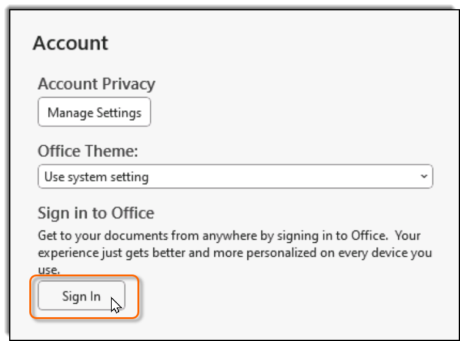
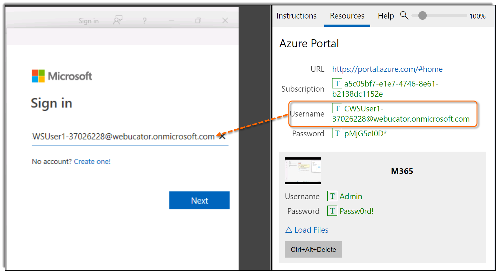
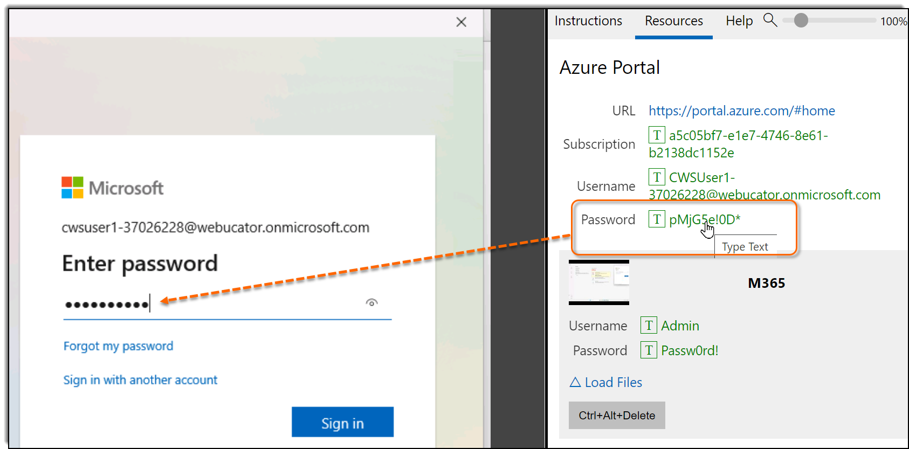
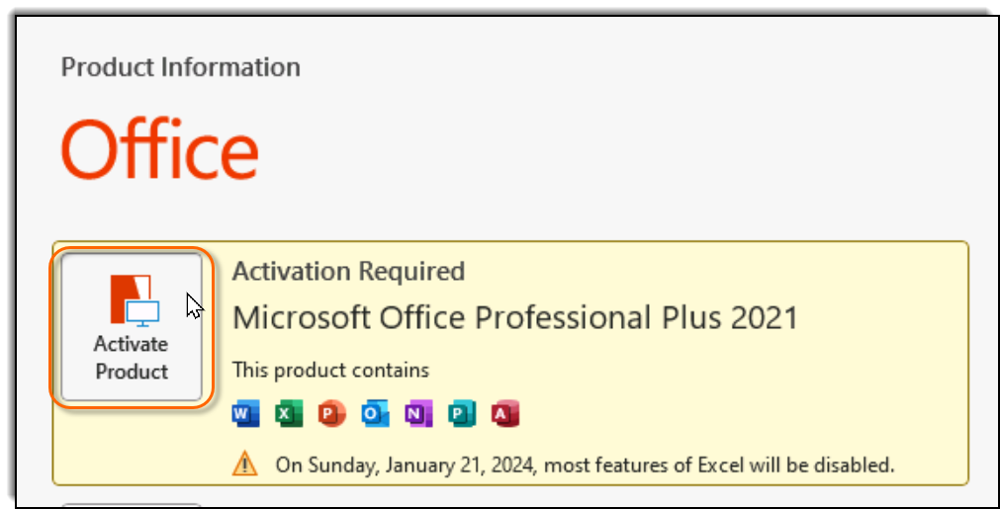

This lab provides you with a license to Microsoft Office. Follow these steps to activate your software.
1. Open the Microsoft product you will be learning (e.g., Excel, Word, PowerPoint, etc.).
2. If a dialog opens asking you to enter a product key, close the dialog.
3. If a dialog opens prompting you to accept the license agreement, accept the agreement.
4. If a **Your privacy matters** dialog opens, close it.
5. Click the **Account** tab in the lower left:
    
6. Click the **Sign In** button:
    
7. Make sure the cursor is in the **Sign in** field.
8. On the **Resources** tab at the top of these instructions, click the Username:
    
    The field should get populated.
9. Repeat the same for the password:
    
    Again, the field should get populated.
10. On the **Stay signed in to all your apps** dialog, press **OK**.
11. You should get a message saying **You're all set!**. Click **Done**.
12. If you get a dialog that says **Office has been updated**, click **Close**.
13. Click the **Activate Product** button:
    
14. Accept the license agreement again.
15. Office should now be activated. Close and reopen the software to update.

You should now be able to use all Office products in the lab!