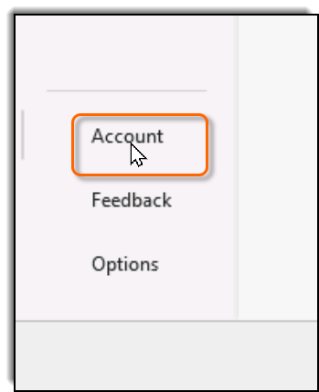

This lab provides you with a license to Microsoft Office. Follow these steps to activate your software.
1. Open the Microsoft product you will be learning (e.g., Excel, Word, PowerPoint, etc.).
2. If a dialog opens asking you to enter a product key, close the dialog.
3. If a dialog opens prompting you to accept the license agreement, accept the agreement.
4. If a **Your privacy matters** dialog opens, close it.
5. Click the **Account** tab in the lower left:
    
6. 
